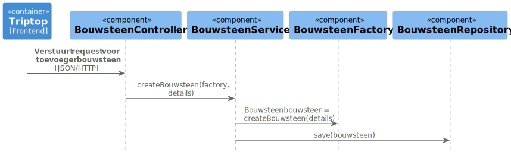

### Wie is verantwoordelijk voor het creëren van een nieuwe instantie van een bouwsteen? Wie is verantwoordelijk voor het verwijderen van een instantie van een bouwsteen?

## Lijst met componenten
* BouwsteenComponent : creeren van instanties van bouwstenen
* BouwsteenService : Voert businesslogica uit
* BouwsteenRepository : opslaan bouwsteen
* TripService : toevoegen/ verwijderen van bouwstenen aan reis
* ApiService : communicatie met externe API's


## Lijst met interfaces

```java
public interface BouwsteenComponent {
Bouwsteen createBouwsteen(String type, Map<String, Object> details);
}
```

```java
public interface BouwsteenService {
Bouwsteen createBouwsteen(String type, Map<String, Object> details);
void deleteBouwsteen(Long bouwsteenId);
Optional<Bouwsteen> getBouwsteenById(Long bouwsteenId);
}
```

```java
public interface BouwsteenRepository {
    void save(Bouwsteen bouwsteen);
    void delete(Long bouwsteenId);
    Optional<Bouwsteen> findById(Long bouwsteenId);
}
```
```java
public interface TripService {
void addBouwsteenToTrip(Long tripId, Bouwsteen bouwsteen);
void removeBouwsteenFromTrip(Long tripId, Long bouwsteenId);
List<Bouwsteen> getBouwstenenForTrip(Long tripId);
}
```
```java
public interface ApiService {
BookingInfo boekOvernachting(Overnachting overnachting);
TransportInfo boekVervoer(Vervoer vervoer);
}
```

## Sequentie diagram


## Class diagram

