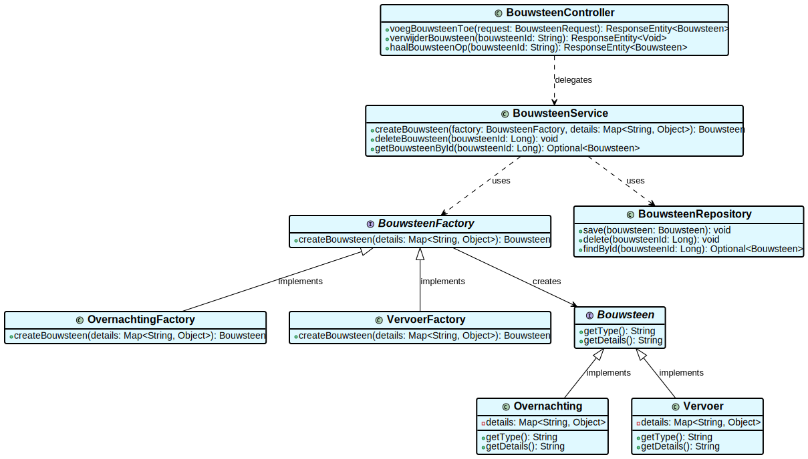

### Wie is verantwoordelijk voor het creëren van een nieuwe instantie van een bouwsteen? Wie is verantwoordelijk voor het verwijderen van een instantie van een bouwsteen?

## Lijst met componenten
* Bouwsteencontroller : Opvangen api-calls frontend
* BouwsteenFactory : creeren van instanties van bouwstenen
* BouwsteenService : Voert businesslogica uit
* BouwsteenRepository : opslaan bouwsteen
* TripService : toevoegen/ verwijderen van bouwstenen aan reis
* ApiService : communicatie met externe API's


## Lijst met interfaces

```java
@RestController
@RequestMapping("/api/bouwstenen")
public interface BouwsteenController {
ResponseEntity<Bouwsteen> voegBouwsteenToe(@RequestBody BouwsteenRequest request);
ResponseEntity<Void> verwijderBouwsteen(@PathVariable String bouwsteenId);
ResponseEntity<Bouwsteen> haalBouwsteenOp(@PathVariable String bouwsteenId);
ResponseEntity<List<Bouwsteen>> haalAlleBouwstenenOpVoorTrip(@PathVariable String tripId);
}
```
```java
public interface BouwsteenFactory {
Bouwsteen createBouwsteen(String type, Map<String, Object> details);
}
```

```java
public interface BouwsteenService {
Bouwsteen addBouwsteen(String type, Map<String, Object> details);
void deleteBouwsteen(Long bouwsteenId);
Optional<Bouwsteen> getBouwsteenById(Long bouwsteenId);
}
```

```java
public interface BouwsteenRepository {
    void save(Bouwsteen bouwsteen);
    void delete(Long bouwsteenId);
    Optional<Bouwsteen> findById(Long bouwsteenId);
}
```
```java
public interface TripService {
void addBouwsteenToTrip(Long tripId, Bouwsteen bouwsteen);
void removeBouwsteenFromTrip(Long tripId, Long bouwsteenId);
List<Bouwsteen> getBouwstenenForTrip(Long tripId);
}
```
```java
public interface ApiService {
BookingInfo boekOvernachting(Overnachting overnachting);
TransportInfo boekVervoer(Vervoer vervoer);
}
```

## Sequentie diagram


## Class diagram



## ADR - Instanties bouwstenen

Datum: 28-03-2025

## Status

## Context

Voor mijn onderzoek heb ik de opdracht gekregen om de volgende vragen te beantwoorden:
* Wie is verantwoordelijk voor het creëren van een nieuwe instantie van een bouwsteen?
* Wie is verantwoordelijk voor het verwijderen van een instantie van een bouwsteen?
De oplossing moest gebruik maken van een design pattern dat tijdens de lessen is behandeld. Na het analyseren van verschillende patronen heb ik gekozen voor het Factory Method Pattern. Dit patroon biedt een gestructureerde manier om objecten aan te maken zonder directe afhankelijkheid van specifieke implementaties.

## Considered Options


Eigenlijk heb ik hierbij geen andere overwogen optie. Alleen vergelijk ik hier de implementatie zonder een factory waarbij alle logica in de service laag staat.
## Decision
Ik heb gekozen voor het Factory Method Pattern als oplossing voor het aanmaken van instanties van bouwstenen.

## Consequences

Voordelen
Uitbreidbaarheid – Nieuwe bouwsteentypes kunnen worden toegevoegd zonder wijzigingen aan bestaande code.
Duidelijke verantwoordelijkheden – Het aanmaken en verwijderen van bouwstenen is gescheiden, waardoor de code beter te begrijpen en onderhouden is.

Nadelen
Complexiteit – Het Factory Method Pattern voegt extra lagen toe, wat de leercurve verhoogt.
