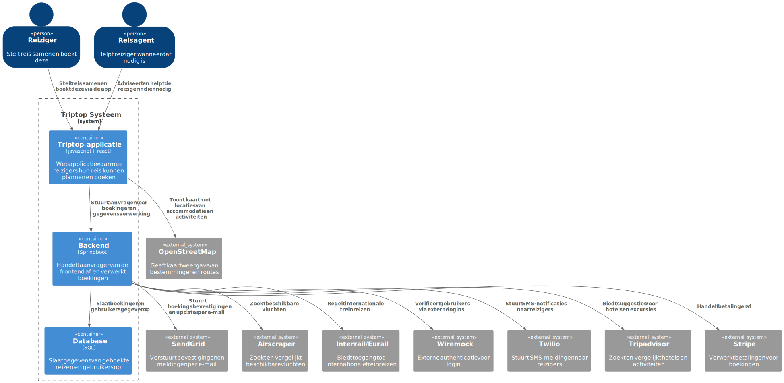
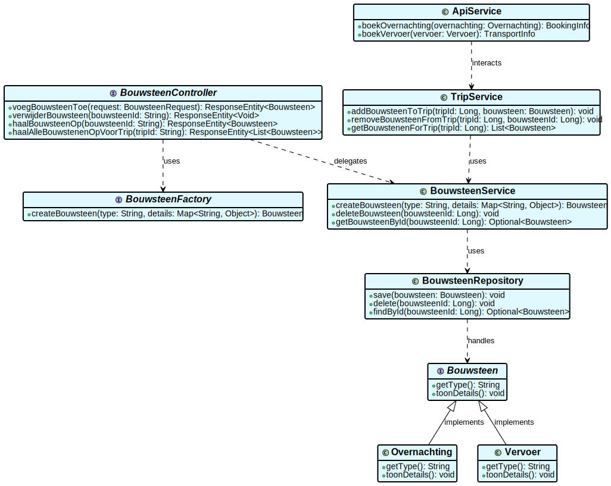
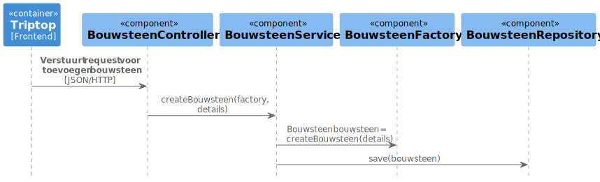

# Software Guidebook Triptop

[//]: # (todo: Mike class diagram toevoegen)
[//]: # (todo: Samengevoegd componentdiagram up to date maken)

## 1. Introduction
Dit software guidebook geeft een overzicht van de Triptop-applicatie. Het bevat een samenvatting van het volgende: 
1. De vereisten, beperkingen en principes. 
2. De software-architectuur, met inbegrip van de technologiekeuzes op hoog niveau en de structuur van de software. 
3. De ontwerp- en codebeslissingen die zijn genomen om de software te realiseren.
4. De architectuur van de infrastructuur en hoe de software kan worden geinstalleerd. 

## 2. Context

  
 Context diagram

Toelichting op de context van de software inclusief System Context Diagram:
* Functionaliteit
* Gebruikers
* Externe systemen

## 3. Functional Overview

Om de belangrijkste features toe te lichten zijn er user stories en twee domain stories gemaakt en een overzicht van het domein in de vorm van een domeinmodel. Op deze plek staat typisch een user story map maar die ontbreekt in dit voorbeeld.

### 3.1 User Stories

#### 3.1.1 User Story 1: Reis plannen

Als gebruiker wil ik een zelfstandig op basis van diverse variabelen (bouwstenen) een reis kunnen plannen op basis van mijn reisvoorkeuren (wel/niet duurzaam reizen, budget/prijsklasse, 's nachts reizen of overdag etc.) zodat ik op vakantie kan gaan zonder dat hiervoor een reisbureau benodigd is.

#### 3.1.2 User Story 2: Reis boeken

Als gebruiker wil ik een geplande reis als geheel of per variabele (bouwsteen) boeken en betalen zodat ik op vakantie kan gaan zonder dat hiervoor een reisbureau benodigd is.

#### 3.1.3 User Story 3: Reis cancelen

Als gebruiker wil ik een geboekte reis, of delen daarvan, kunnen annuleren zodat ik mijn geld terug kan krijgen zonder inmenging van een intermediair zoals een reisbureau.

#### 3.1.4 User Story 4: Reisstatus bewaren 

Als gebruiker wil ik mijn reisstatus kunnen bewaren zonder dat ik een extra account hoef aan te maken zodat ik mijn reis kan volgen zonder dat ik daarvoor extra handelingen moet verrichten.

#### 3.1.5 User Story 5: Bouwstenen flexibel uitbreiden

Als gebruiker wil ik de bouwstenen van mijn reis flexibel kunnen uitbreiden met een zelf te managen stap (bijv. met providers die niet standaard worden aangeboden zoals een andere reisorganisatie, hotelketen etc.) zodat ik mijn reis helemaal kan aanpassen aan mijn wensen.

### 3.2 Domain Story Reis Boeken (AS IS)

### 3.3 Domain Story Reis Boeken (TO BE)

### 3.4 Domain Model

## 4. Quality Attributes

Voordat deze casusomschrijving tot stand kwam, heeft de opdrachtgever de volgende ISO 25010 kwaliteitsattributen benoemd als belangrijk:
* Compatibility -> Interoperability (Degree to which a system, product or component can exchange information with other products and mutually use the information that has been exchanged)
* Reliability -> Fault Tolerance (Degree to which a system or component operates as intended despite the presence of hardware or software faults)
* Maintainability -> Modularity (Degree to which a system or computer program is composed of discrete components such that a change to one component has minimal impact on other components)
* Maintainability -> Modifiability (Degree to which a product or system can be effectively and efficiently modified without introducing defects or degrading existing product quality)
* Security -> Integrity (Degree to which a system, product or component ensures that the state of its system and data are protected from unauthorized modification or deletion either by malicious action or computer error)
* Security -> Confidentiality (Degree to which a system, product or component ensures that data are accessible only to those authorized to have access)

## 6. Principles

### Ontwerpvraag Mike

- Hoe maak je de applicatie uitbreidbaar met nieuwe bouwstenen?  

Om een prototype te kunnen bouwen waarmee ik antwoord geef op mijn gekozen ontwerpvraag, heb ik gebruik moeten maken van het strategy-pattern.
Wanneer je een strategy patten gebruikt, gebruik je daar automatisch de `composition over inheritance`- en `open-closed` principes bij.  

Ik heb ervoor gekozen dit pattern en deze principes te gebruiken omdat je, wanneer je ze op de juiste manier toepast, je enkel de implementatie van een service, de implementatie van een bouwsteen en de implementatie van een adapter hoeft te schrijven.
In de oude code hoeft bijna niets veranderd te worden om het programma te laten functioneren met de nieuwe bouwsteen.  

Idealiter had ik er in mijn prototype voor gezorgd dat er, na het toevoegen van een nieuwe bouwsteen, compleet geen oude code aan had hoeven passen, bijvoorbeeld door gebruik te maken van reflection of het zoeken door Spring Boot Beans. Helaas is dit door een tekort aan tijd niet gelukt.  

### Ontwerpvraag Marijn

- Hoe zorg je ervoor dat je makkelijk een nieuwe externe service kan toevoegen?

We kiezen voor het adapter pattern omdat het de meeste flexibiliteit biedt bij het toevoegen van nieuwe externe services. Het houdt de code schoon en zorgt ervoor dat de kernlogica niet afhankelijk is van specifieke externe implementaties.

### Ontwerpvraag Bartu

Om te bepalen wie verantwoordelijk is voor het creëren en verwijderen van een bouwsteen, heb ik de Factory Method Pattern toegepast. Deze pattern zorgt ervoor dat de logica voor het creëren van nieuwe bouwstenen wordt gecentraliseerd en flexibel blijft.

#### Open-closed principle
Het Open-Closed Principle wordt hierbij ook toegepast, omdat de code uitbreidbaar is zonder bestaande functionaliteit aan te passen. Nieuwe bouwsteentypes kunnen eenvoudig worden toegevoegd door nieuwe factory klasse, die door het gebruik van reflection automatisch worden uitgebreid aan de applicatie.

#### Program to interface
Daarnaast maak ik gebruik van Program to Interfaces, Not Implementations. 

####  Single Responsibility Principle
Verder is het Single Responsibility Principle van toepassing: de verantwoordelijkheid zijn duidelijk verdeeld over de klassen, zodat elke klasse een specifieke taak heeft. De BouwsteenFactory is verantwoordelijk voor het creëren van bouwstenen, terwijl de BouwsteenRepository zich bezighoudt met het beheren van de opslag en verwijdering naar de database.

## 7. Software Architecture

###     7.1. Containers
  
 Container diagram 

[//]: # (todo: begeleidende tekst ontbreekt)

###     7.2. Components

### Componentdiagram Marijn
  
 Diagrammen Marijn

[//]: # (todo: begeleidende tekst ontbreekt)

### Componentdiagram Bartu
  
Component diagram Bartu

Dit componentendiagram toont de backend van het Trip-top systeem, met de focus op het verwerken van bouwstenen. De frontend stuurt aanvragen naar de BouwsteenController, die deze verder afhandelt via de BouwsteenService. Deze service bevat de kernlogica en maakt gebruik van de BouwsteenFactory om nieuwe bouwstenen aan te maken en van de BouwsteenRepository om gegevens op te slaan in de database.

### Componentdiagram Mike

  
 Componentdiagram Mike 

[//]: # (todo: begeleidende tekst ontbreekt)

###     7.3. Design & Code

### Klassediagram Marijn

Class diagram Marijn 

[//]: # (todo: begeleidende tekst ontbreekt)

### Dynamic diagram Marijn

 Dynamic diagram Marijn

[//]: # (todo: begeleidende tekst ontbreekt)

### Klassediagram Bartu

  
Class diagram Bartu 

[//]: # (todo: begeleidende tekst ontbreekt)

Sequence diagram Bartu

Dit sequentiediagram laat zien hoe een verzoek vanuit de frontend om een bouwsteen toe te voegen wordt verwerkt. De BouwsteenController ontvangt het verzoek en schakelt de BouwsteenService in, die via de BouwsteenFactory een nieuw bouwsteen aanmaakt en dit vervolgens opslaat via de BouwsteenRepository.

### Klassediagram Mike  
  
 Klassediagram Mike  

Belangrijk om te vermelden is dat de klasse `Bouwsteen` geen dependencypijlen naar andere klasses heeft. 
Dit is onder andere gedaan om het overzicht te bewaren, maar ook omdat in veel klasses de dependency al duidelijk is door de returntypes die gegeven zijn.

### Sequence Diagram Mike

Dit sequence diagram beschrijft de stappen die worden gezet wanneer een bouwsteen wordt opgeslagen.

## 8. Architectural Decision Records

### 8.1. ADR-001 Applicatie voor reisagent

Datum: 21-03-2025

## Status
Accepted

## Context

Voor de Triptop-applicatie die we aan het voorbereiden zijn, moet een reiziger een reis kunnen plannen. Als de reiziger er zelf niet uit komt, moet de reiziger een reisagent om assistentie kunnen vragen.
Wanneer de reisagent een reiziger helpt, kan het handig zijn als de reisagent meer of juist andere informatie kan zien dan een reiziger. De vraag is alleen of we deze extra informatie beschikbaar willen maken in de normale applicatie, of dat er voor de reisagent een andere applicatie gemaakt moet worden.

## Considered Options

|                               | 1 Applicatie | 2 Applicaties |
|-------------------------------|--------------|---------------|
| Ontwikkeltijd                 | ++           | --            | 
| Onderhoud                     | ++           | --            |  
| Scheiding van unieke functies | -            | +             |
| Dubbele functionaliteiten     | ++           | --            |
| Interactie met backend        | 0            | 0             |

## Decision

We hebben ervoor gekozen om 1 applicatie te maken waar, afhankelijk van de rollen van de ingelogde persoon, bepaalde functionaliteiten wel of niet worden weergegeven. Dit zorgt ervoor dat de geschatte ontwikkelijktijd relatief gezien laag blijft en we de benodigde applicatie met 1 ontwikkelteam kunnen bouwen.

## Consequences

- Minder developers nodig
- Minder ontwikkeltijd nodig
- Makkelijker te onderhouden
- Niet scheiden van functionaliteiten maakt de applicatie soms dubbelzinnig
- Er moet strict bijgehouden worden welke gebruiker welke rechten heeft
- 
### 8.2. ADR-002 Welke maps-api gaan we gebruiken?

Datum: 21-03-2025

## Status
Accepted

## Context
Bij het bekijken van waar bepaalde hotels hun locatie hebben, is het voor de reiziger handig als dit weergegeven wordt op een wereldkaart. Nu bestaan er meerdere online kaarten die hiervoor gebruikt kunnen worden.
Het is voor ons zaak dat we de beste kaart voor onze usecase vinden en gebruiken.

## Considered Options

|                                   | Google Maps | Apple Maps | OpenStreetMap |
|-----------------------------------|-------------|------------|---------------|
| Kosten                            | 0           | +          | ++            |
| Beschikbaarheid (uptime)          | ++          | ?          | +             |
| Development time                  | +           | +          | 0             |
| Moeilijkheidsgraad van integreren | ++          | +          | ++            |
| Nauwkeurigheid                    | ++          | +          | ++            |
| Privacy                           | 0           | 0          | ++            |
| Aangepaste functionaliteit        | ++          | 0          | ++            |

Bronnen:  
Google Maps uptime: https://status.cloud.google.com/maps-platform/summary  
OpenStreetMap uptime: https://uptime.com/upstatus/openstreetmap.org

Google Maps kosten: https://mapsplatform.google.com/pricing/  
Apple Maps kosten: https://developer.apple.com/maps/web/  
OpenStreetMap kosten: https://www.openstreetmap.org/copyright

Google Maps naslagwerk: https://developers.google.com/maps/documentation  
Apple Maps naslagwerk: https://developer.apple.com/documentation/applemapsserverapi/  
OpenStreetMap naslagwerk: https://taginfo.openstreetmap.org/taginfo/apidoc

## Decision

Hoewel de uptime van Apple Maps waarschijnlijk vrij hoog ligt, hebben we hier geen historische data van kunnen vinden. Daarom lijkt, gebaseerd op deze tabel, OpenStreetMap de beste optie.

## Consequences

- We zullen onze diagrammen hierop aan moeten passen
- De kaart ziet er voor de reiziger anders uit
- Langere ontwikkelingstijd aangezien het integreren lastiger is
- Gegevens van gebruiker zijn goed beschermd
- Er is geen sprake van extra maandelijkse kosten
### 8.3. Welke betalingsmethode gaan we gebruiken?

Datum: 21-03-2025

## Status

Adyen, Mollie, Stripe

## Context

We moeten een veilige en gebruiksvriendelijke betalingsmethode hebben waarmee gebruikers hun reis kunnen betalen. We hebben er meerdere tot onze beschikking en het is zaak voor ons om te kijken welke het beste aansluit bij onze wensen.

| Kenmerk               | Adyen | Stripe | Mollie |
|-----------------------|-------|--------|--------|
| Aantal betaalmethodes | +     | ++     | ++     |
| Integratiegemak       | +     | ++     | +      |
| Gebruikersgemak       | +     | ++     | ++     |
| Documentatie/API      | +     | ++     | +      |
| Webhook ondersteuning | ++    | ++     | +      |
| Kopersbescherming     | 0     | +      | ++     |
| Transactiekosten      | -     | -      | +      |

[//]: # (todo: Marijnof Bartu, een van jullie mag hier bronnen gaan toevoegen)
Bronnen:

## Decision

In eerste instantie kozen we voor Adyen, omdat dit de eerste was die in ons opkwam. Na verder onderzoek gedaan te hebben, zijn we tot de conclusie gekomen dat Stripe eigenlijk beter aansluit op onze eisen en wensen.

## Consequences

- We zullen onze diagrammen hierop aan moeten passen
- We zullen meer kosten maken per transactie

## 8.4. ADR-004 - Instanties bouwstenen

Datum: 28-03-2025

## Status

## Context

Voor mijn onderzoek heb ik de opdracht gekregen om de volgende vragen te beantwoorden:
* Wie is verantwoordelijk voor het creëren van een nieuwe instantie van een bouwsteen?
* Wie is verantwoordelijk voor het verwijderen van een instantie van een bouwsteen?
  De oplossing moest gebruik maken van een design pattern dat tijdens de lessen is behandeld. Na het analyseren van verschillende patronen heb ik gekozen voor het Factory Method Pattern. Dit patroon biedt een gestructureerde manier om objecten aan te maken zonder directe afhankelijkheid van specifieke implementaties.

## Considered Options

Eigenlijk heb ik hierbij geen andere overwogen optie. Alleen vergelijk ik hier de implementatie zonder een factory waarbij alle logica in de service laag staat.
## Decision
Ik heb gekozen voor het Factory Method Pattern als oplossing voor het aanmaken van instanties van bouwstenen.

## Consequences

Voordelen
Uitbreidbaarheid – Nieuwe bouwsteentypes kunnen worden toegevoegd zonder wijzigingen aan bestaande code.
Duidelijke verantwoordelijkheden – Het aanmaken en verwijderen van bouwstenen is gescheiden, waardoor de code beter te begrijpen en onderhouden is.

Nadelen
Complexiteit – Het Factory Method Pattern voegt extra lagen toe, wat de leercurve verhoogt.

### 8.5. ADR-005 TITLE

> [!TIP]  
> These documents have names that are short noun phrases. For example, "ADR 1: Deployment on Ruby on Rails 3.0.10" or "ADR 9: LDAP for Multitenant Integration". The whole ADR should be one or two pages long. We will write each ADR as if it is a conversation with a future developer. This requires good writing style, with full sentences organized into paragraphs. Bullets are acceptable only for visual style, not as an excuse for writing sentence fragments. (Bullets kill people, even PowerPoint bullets.)

#### Context

> [!TIP]
> This section describes the forces at play, including technological, political, social, and project local. These forces are probably in tension, and should be called out as such. The language in this section is value-neutral. It is simply describing facts about the problem we're facing and points out factors to take into account or to weigh when making the final decision.

#### Considered Options

> [!TIP]
> This section describes the options that were considered, and gives some indication as to why the chosen option was selected.

#### Decision

> [!TIP]
> This section describes our response to the forces/problem. It is stated in full sentences, with active voice. "We will …"

#### Status

> [!TIP]
> A decision may be "proposed" if the project stakeholders haven't agreed with it yet, or "accepted" once it is agreed. If a later ADR changes or reverses a decision, it may be marked as "deprecated" or "superseded" with a reference to its replacement.

#### Consequences

> [!TIP]
> This section describes the resulting context, after applying the decision. All consequences should be listed here, not just the "positive" ones. A particular decision may have positive, negative, and neutral consequences, but all of them affect the team and project in the future.

